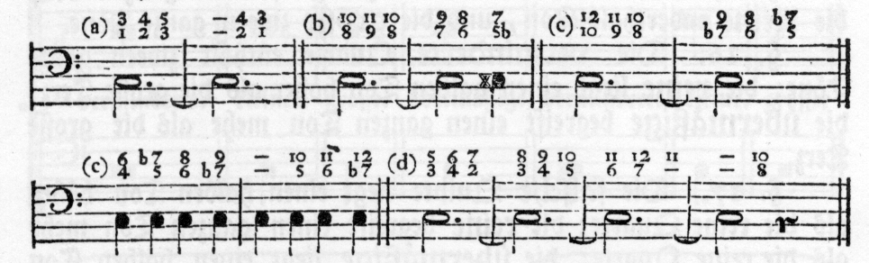
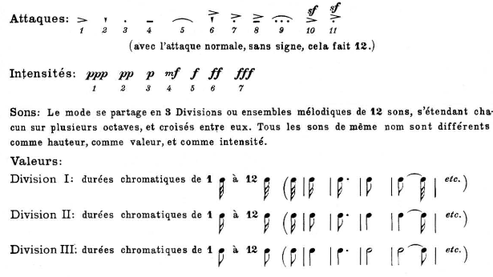
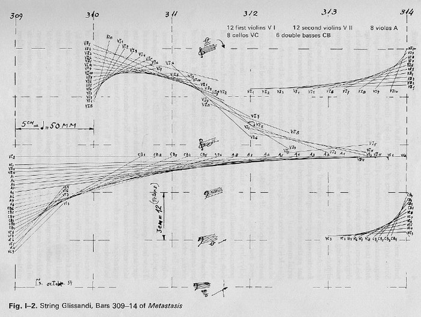
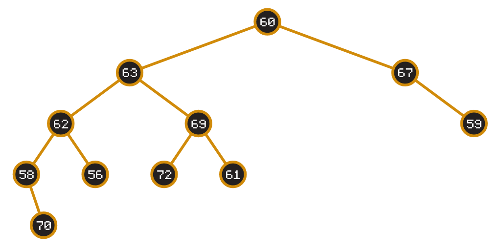

#### WebSoundArt
## Composing With Code
Laurens Inauen

---

### Plan
1. Introduction with slides
	1. What is composition?
	2. What are data structures?
	3. What are data types
2. Coding

---

### What is composition?*

---

The structuring of musical events over time.

---

### How is this achieved?

---

<split even>

 

</split>

---

### Compositional Systems

→ system produces music\
→ desire for new music\
→ new system\
→ rinse, repeat

---
### Compositional Systems

- may express the same things
	- this is the basis of my master thesis
	- as do computational models
	- as do programming languages
- influence the way we compose

---

### Compositional Systems

- Have some way of formalizing/structuring musical events
- Have some way of putting events into relationships

---

### Compositional Systems

how does this relate to code?

---

### Compositional Systems

- We can translate existing systems into code
- We can create **new systems** _using code_

---

### Compositional Systems

If we think of musical events as data, there are already many such formalized structures that exist. We call them _data structures_.

---

what kind of _data structures_ do you know?

---

### Data Structures


---

### Data Structures


non-primitive data structures are often linked with some behavior - called _algorithms_

---

### Data Structures: Example Stack

```javascript
function Stack() {
  this.items = [];
}

Stack.prototype.push = function(element) {
  this.items.push(element); 
};

Stack.prototype.pop = function() {
  if (this.items.length === 0) {
    return null;
  }
  return this.items.pop();
};
```

---

### Data Structures: Example Queue

```javascript
function Queue() {
  this.items = [];
}

Queue.prototype.enqueue = function(element) {
  this.items.push(element);
};

Queue.prototype.dequeue = function() {
  if (this.items.length === 0) {
    return null;
  }
  return this.items.shift();
};
```

---

### Data Structures: Binary Tree



---

### Data Structures: Binary Tree

This is what we build today, but...

---

How can we formalize this structure?

---

### Data Types

Normally we formalize data (structures) using _data types_.

---
### Data Types: The Problem

Javascript is a dynamically and weakly typed language.

```js
// dynamic typing
let a = "some string";
a = 10;

// weak typing
let a = "some string";
console.log(a + 5) // output: "some string5"
```


---

### Data Types: The Problem

This makes it incredibly difficult to reason about a "composition".

---

### Data Types: Example

```js
// some variable exists called note
console.log(note)
// output: "A"
```

- What do we know about this variable before we print it?
- What do we know about this variable after we print it?
- What do we know about the concept of "note" within this program?
- What if the variable was called _value_?

---

### Data Types: Example


```js
// some variable exists called note
console.log(note)
// output:
//{
//  pitch: 12,
//  velocity: 30
//}
```

- What do we know about this variable before we print it?
- What do we know about this variable after we print it?
- What do we know about the concept of "note" within this program?

---

### Data Types: Example

consider the following implementation:

```js
const makeNote = (pitch, velocity, waveform) => {
  if (waveform) {
     return { pitch, velocity, waveform };
  }
  return { pitch, velocity };
};

// any of this is valid
const note1 = makeNote(100, 20);
const note2 = makeNote(100, 20, "square");
const note3 = makeNote(100, 20, 3);
```

---

### Data Types: The Problem

We know nothing at all!

---

### Data Types: The Problem

Now you can say:

... I know my own program\
... I can just go check\
... I can implement runtime checks\
... something else


---

### Data Types: The Problem

This is true, but it leads to a lot of additional complexity in your brain.

We could also try to write Xenakis in traditional notation.

---

### Data Types: The Solution

Typescript

---

### Data Types: The Solution

Typescript let's us define _data types_ and thus describe _data structures_, which makes it easier to reason about our code or composition.

---

Let's try it out

---

- `git clone https://github.com/laurens-in/WSA-Composing-With-Code.git`
- `git clone git@github.com:laurens-in/WSA-Composing-With-Code.git`

---
### Data Structure: Binary Search Tree

A binary search tree has a few characteristics:

- it is balanced (no leaves are further than 1 level apart)
- from any parent:
	- its left node is lesser than itself
	- its right node is greater than itself

---

### Data Structure: Binary Search Tree


---

### Data Structure: Binary Search Tree

They can be complicated if they have to be kept updated, however we only initialize them once, so we can use a little trick.

---

Let's try it out!

---

### Conclusion

- This example was on a very abstract micro level
- It is up to you to create more interesting stuff ;)
- We can use _data structures_ and _algorithms_ to compose music, which can shape our composition

---

If you come across any kind of computer science concept, ask yourself:

_How can I make music with this?_